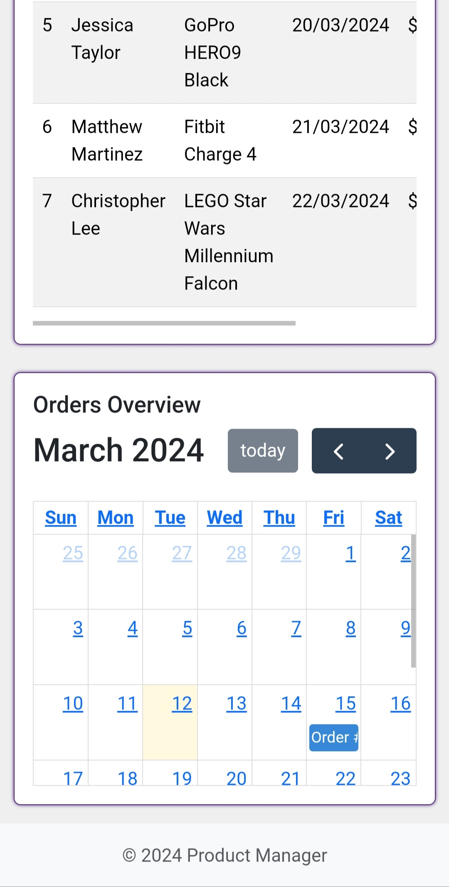

## Product Manager
This is a app for the "Product Managermenet" in React(Static) [more](#usage). <br>


## Table of Contents

- [Installation](#installation)
- [Technologies Used](#technologies-used)
- [Usage](#usage)
- [Interacting](#interacting-with-the-website)
- [Screenshots](#screenshots)

## Installation

1. **Clone the repository:**
   ```bash
   git clone https://github.com/haxkd/ProductManager.git

2. Navigate to the project directory:
   ```bash
   cd ProductManager

4. Install dependencies:
   ```bash
   npm install

6. Start the development server:
   ```bash
   npm start

## Technologies Used
- React
- HTML
- CSS
- JavaScript
- Bootstrap
- Chart.js 
- JQuery DataTable

## Usage

- / - Dashboard Provides an overview of all the data , sales, Users, Top Products, notifications, Orders by date in the calender.
- /products -  This is used for displaying all products in a table.
- /products/:id  - This page displays product details including price, description etc informations and it can be meodify or delete for their.
- /orders  - This page displays orders made by customer in a table.
- /orders/:id - This page displays orders details including price, order date, amount and status and their it can be edit or delete.
- /users - This page displays all customers in a table.
- /users/:id - This page displays a customer details.
- /addproduct - This form can be used to add a new product.
- /messages - This page displays all messages by the customercustomers in a table.
- /messages/:id - It show a message details its subject, date and from their response can be send.

## Interacting with the Website
### Navigation:
- Use the navigation menu or links to explore different sections of the website.

### Interact with Features:
- Follow on-screen instructions to interact with various features such as forms, buttons, inputs, etc.

### Submit Forms:
- Fill out any required forms and submit them as instructed.

### View Results:
- View the results or responses on the website interface.


## Screenshots
- Dashboard(Desktop)


- Dashboard(Mobile)



